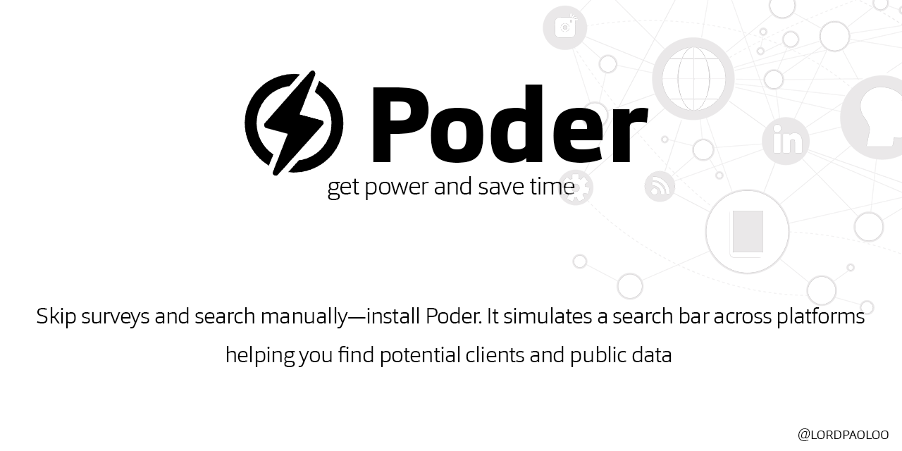

# **Poder**

  

A powerful tool to collect publicly available data from social media platforms such as Facebook pages or hashtags. It organizes the extracted information, including names, phone numbers, emails, and links, into an easy-to-manage Excel sheet.

## **Beta Version**
The **Beta Version** of the Data-Sheeter will be released on **30-01-2025**.

### **Features**:
- **AI Chat Integration**:
  An intelligent AI assistant powered by OpenAI’s GPT model that automates data extraction and provides real-time insights from social media platforms.

- **Multi-Platform Data Collection**:
  Collect data from Facebook, YouTube, Instagram, and other social media platforms.

- **Excel Data Organization**:
  Extracted data is organized into structured Excel sheets for easy accessibility and management.

- **Scalable and Efficient**:
  Designed for scalability and efficient one-man operation, making it ideal for marketers, analysts, and data-driven businesses.

### **Why Choose Poder?**
- **Automate Your Data Collection**: Save time and effort by automating the data extraction process.
- **Real-Time Insights**: Get real-time insights and analytics from your collected data.
- **User-Friendly Interface**: Easy to use, even for those with minimal technical skills.
- **Secure and Reliable**: Your data is handled with the utmost security and reliability.

### **Release Plans**:
- **Beta Version**: Launching on **31-01-2025**
- **Full Version**:
  - AI-driven enhancements
  - Integrated search functionality across YouTube, Instagram, and other platforms
  - Advanced features tailored to automate and streamline data collection.

### **Download Beta Version**
To download the beta version, please check the [releases page](https://github.com/lordpaoloo/Poder/releases).

### **Join the Journey**
This project is an ambitious task for one person! If you’re interested in contributing or want to collaborate, feel free to **reach out to me on Discord**.

👉 **Discord**: lordpaolo

### **License**
This project is licensed under the MIT License. See the [LICENSE](LICENSE) file for more details.

---
